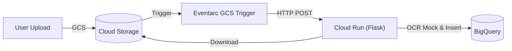

# GCP Serverless Event-Driven Document Pipeline

An automated document metadata ingestion and indexing pipeline built using Google Cloud Storage, Eventarc, Cloud Run, and BigQuery.

## Architecture



1. **Ingestion**: User uploads a text file to Cloud Storage.
2. **Trigger**: Eventarc detects the upload and forwards a CloudEvent payload to Cloud Run.
3. **Processor**: Flask service on Cloud Run downloads the file, counts words, and extracts tags.
4. **Storage**: Metadata (filename, upload time, tags, word count) is streamed into BigQuery.

---

## Getting Started

### 1. Local Mock Testing (No GCP Required)
Run the application locally using mock interfaces for Cloud Storage and BigQuery:
```bash
python3 -m venv .venv && source .venv/bin/activate
pip install -r requirements.txt -r requirements-dev.txt
pytest
./test_local.sh
```
*Manual Local Server*: Run `MOCK_GCP=true BQ_TABLE_ID=mock.dataset.table PORT=8080 python3 -m src.app` and open `http://localhost:8080`.

### 2. Live GCP Deployment
Deploy the infrastructure and application to Google Cloud, then run integration tests:
```bash
gcloud auth login && gcloud config set project <PROJECT_ID>
./deploy.sh
./test_cloud.sh
```

---

## Detailed Guides

Refer to the [docs](docs) folder for specific configuration and management playbooks:

*   📖 [**Local Setup Guide**](docs/setup.md): Setup virtual environment and mock tests.
*   📖 [**GCP Deployment Guide**](docs/deployment.md): Details on script provisioning, APIs, and IAM service accounts.
*   📖 [**Dashboard Access Guide**](docs/access_dashboard.md): Securely access the private dashboard URL using local proxy commands.
*   📖 [**Clean Up Guide**](docs/cleanup.md): Safely delete GCP resources to prevent billing charges.

---

## License

This project is licensed under the Apache License 2.0. See the [LICENSE](LICENSE) file for details.

